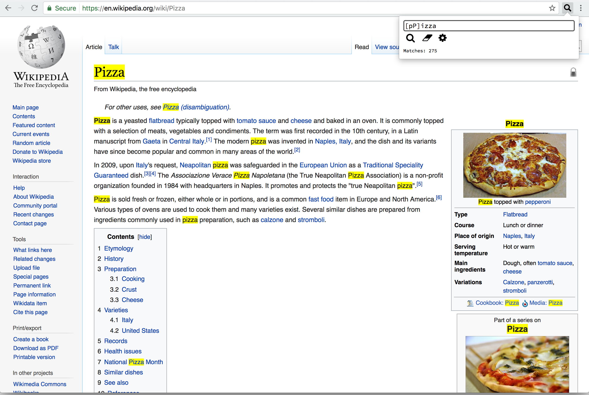

# Regex Search Chrome Extension 🔍

# Installation Instructions 👾
* Go to chrome://extensions
* Check 'Developer mode'
* Click 'Load unpacked extension'

# Usage 🔥
* Use `CTRL+SHIFT+F` to activate on Windows and Linux
* On macOS, use `CONTROL+SHIFT+F`, not `CMD`

# Screenshots

